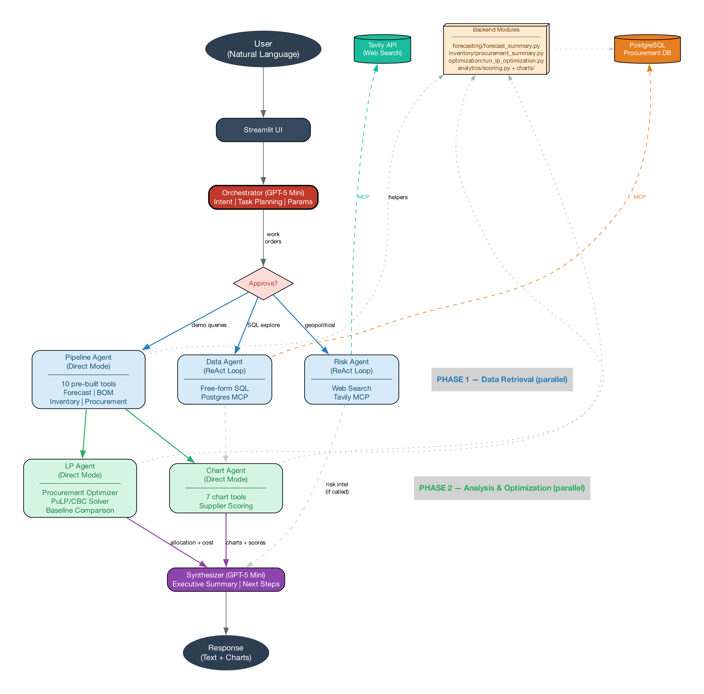

# Procurement Agent — Multi-Agent Decision Intelligence for Semiconductor Supply Chains

An AI-powered procurement decision system that translates natural-language questions into end-to-end recommendations — from demand forecasting through LP-optimized supplier allocation. Built as a Business Analytics capstone, it pairs a multi-agent LangGraph runtime with a structured analytical pipeline (forecasting → BOM → inventory → LP optimization → executive summary), and presents results through a Streamlit demo designed for procurement and supply-chain decision-makers.

> **Example query:** *"From our available suppliers, provide a procurement plan to ensure we meet demand under moderate risk aversion. No supplier should exceed 40% of total supply volume."*

---

## Table of Contents

1. [Why This Project](#1-why-this-project)
2. [Key Capabilities](#2-key-capabilities)
3. [System Architecture](#3-system-architecture)
4. [Runtime Flow — End-to-End Trace](#4-runtime-flow--end-to-end-trace)
5. [Per-Agent Runtime Details](#5-per-agent-runtime-details)
6. [Streamlit UI Layer](#6-streamlit-ui-layer)
7. [Demo Walkthrough](#7-demo-walkthrough)
8. [Repository Structure](#8-repository-structure)
9. [Tech Stack](#9-tech-stack)
10. [Quickstart](#10-quickstart)
11. [Data & Models](#11-data--models)
12. [Module Index](#12-module-index)
13. [Notes & Caveats](#13-notes--caveats)

---

## 1. Why This Project

Procurement teams in electronics manufacturing face a structurally hard problem: demand is volatile, lead times are stochastic, suppliers are globally distributed under shifting tariff and geopolitical regimes, and the cost of a stockout dwarfs the cost of holding inventory. Existing tools fragment the workflow — forecasting lives in spreadsheets, supplier scoring lives in PDF rubrics, LP optimization lives with operations researchers, and the final recommendation is glued together by a procurement analyst the night before the meeting.

This project compresses that workflow into a single conversational interface. A user asks the question; a multi-agent system decomposes it into the right sub-tasks, runs the underlying analytics, and returns a **board-ready procurement plan** with the cost–risk tradeoff made explicit. The architecture is deliberately modular: each analytical layer (forecasting, BOM, inventory, LP, scoring) is a self-contained module with its own README and tests, and the agent layer composes them through declarative tool calls rather than hard-coded pipelines.

---

## 2. Key Capabilities

**Decision outputs**
- Risk-adjusted landed-cost ranking across a global supplier universe, with compliance filtering, MOQ checks, and tiered classification
- Session-level executive summary aggregating all approved LP runs, with baseline cost comparison and risk-premium quantification
- Targeted sourcing guidance when a feasible plan cannot be produced under current constraints

**Analytical pipeline**
- Facility × product × week demand forecasting grounded in historical commodity and production data, with 90% confidence intervals
- BOM-based explosion of finished-good demand into procurement-level component requirements
- Base-stock inventory policy with stochastic lead times, rolling depletion, and weekly trigger signals
- LP optimization with cost-vs-risk tradeoff (`λ_risk`), supplier-share caps, country diversification (MIP), urgency mode, and what-if exclusion scenarios

**Agent runtime**
- LLM-driven orchestrator that classifies user intent and emits a typed task list
- Two-phase parallel execution (data + risk + pipeline → chart + LP)
- Human-in-the-loop approval interrupts for every LP run before it enters the executive summary
- External knowledge integration via Postgres MCP (live SQL) and Tavily MCP (web search for tariffs, sanctions, geopolitical events)

---

## 3. System Architecture

### 3.1 Architecture Diagram



*Source PNG: `demo/architecture/architecture_flowchart.png`. Slide-format and vertical variants are available in the same directory; generation scripts live alongside (`generate_flowchart*.py`).*

### 3.2 Two-Phase Multi-Agent Topology

The runtime is a **LangGraph** directed graph with one orchestrator node, two parallel execution phases, and a synthesis node:

```
                ┌──────────────┐
  user query →  │ Orchestrator │   LLM intent classification
                │  (LLM + tool │   → typed task list
                │   selection) │   → param_extractor (LP)
                └──────┬───────┘
                       │
            ┌──────────┴──────────┐
            ▼                     ▼
   ┌─────────────────┐   ┌─────────────────┐   Phase 1 — parallel
   │   data_agent    │   │   risk_agent    │   • SQL via Postgres MCP
   │  pipeline_agent │   │   (Tavily MCP)  │   • Web search
   └────────┬────────┘   └────────┬────────┘   • Pre-built fast queries
            └──────────┬──────────┘
                       ▼
            ┌──────────────────────┐
            │     phase2_router    │
            └──┬────────────────┬──┘
               ▼                ▼
       ┌─────────────┐   ┌─────────────┐    Phase 2 — analytical
       │ chart_agent │   │  lp_agent   │    • Charts (matplotlib)
       └──────┬──────┘   └──────┬──────┘    • LP solve + interrupt()
              │                 │
              │      (human-in-the-loop:
              │       approve / discard /
              │       modify before continuing)
              │                 │
              └────────┬────────┘
                       ▼
                ┌─────────────┐
                │ Synthesizer │   LLM rollup of all
                │    (LLM)    │   agent_results + chart_results
                └──────┬──────┘
                       ▼
                Streamlit UI render
```

Defined in `demo/graph/builder.py` (graph topology, ~93 lines). Routing edges are conditional functions: `route_phase1`, `route_phase2`, and `_route_post_execution` (which decides whether the synthesizer is needed — it is skipped when only `pipeline_agent` ran, since pre-built queries return display-ready output).

### 3.3 Agent Roster

| Agent | File | Responsibility | Execution Mode |
|---|---|---|---|
| **orchestrator** | `demo/graph/orchestrator.py` | LLM classifies intent, emits `OrchestratorOutput { intent, tasks[] }` where each task carries `agent`, `tool`, `params_json`, `phase` | LLM (Azure OpenAI) |
| **data_agent** | `demo/graph/data_agent.py` | Free-form SQL: supplier profiles, inventory positions, BOM lookups | ReAct loop over Postgres MCP |
| **risk_agent** | `demo/graph/risk_agent.py` | Tariff, sanction, and geopolitical web search | ReAct loop over Tavily MCP |
| **pipeline_agent** | `demo/graph/pipeline_agent.py` | Pre-built fast queries (forecast / BOM / inventory views) — sub-second | Direct execution, no ReAct |
| **chart_agent** | `demo/graph/chart_agent.py` | Supplier scoring, country comparison, risk visualizations | Direct execution + dynamic scoring |
| **lp_agent** | `demo/graph/lp_agent.py` | LP solve, then `interrupt()` for human approval before downstream nodes proceed | Direct execution + LangGraph interrupt |
| **synthesizer** | `demo/graph/synthesizer.py` | LLM rollup of all agent outputs into a single executive narrative | LLM |

Routing helpers: `demo/graph/router.py`. Shared state schema: `demo/graph/state.py` (`AgentState` TypedDict — `messages`, `tasks`, `agent_results`, `chart_results`, `raw_data`, `approved_lp_runs`, `timings`, etc.; map-typed fields use LangGraph reducers for parallel-safe merging).

### 3.4 Backend Analytical Pipeline

The agent layer composes six deterministic stages, each backed by a self-contained module:

```
1. Forecast demand
       Facility × product × week, 20-week horizon, 90% CI
       → forecasting/run_pipeline.py (validation), run_production.py (live)
       → HistGradientBoostingRegressor; holdout MAE 205.93, RMSE 289.37, R² 0.78

2. BOM translation
       Finished-good demand × component qty-per-unit → gross component demand
       → sql/views.sql :: vw_component_requirement_detail (weekly)
                       :: vw_component_requirement_lp     (horizon aggregate)
       → inventory/procurement_summary.py :: format_bom_translation

3. Inventory policy
       Base-stock (order-up-to) with stochastic lead times
       review_period r = 8 weeks, service-level z = 1.65 (95%)
       S = μ_D·(r + μ_L) + z · √((r + μ_L)·σ_D² + μ_D²·σ_L²)
       Rolling depletion model identifies the trigger week
       → inventory/run_inventory.py

4. Net procurement requirement
       Horizon level: max(0, gross_demand + SS − on_hand − SR + BO)  →  LP input
       Weekly trigger view: which weeks/facilities cross the SS floor
       → sql/views.sql :: vw_procurement_requirement(_lp)

5. LP optimization
       minimize  Σ_j  c_j · (1 + λ_risk · r_j + λ_urgency · lt_norm_j) · x_j
       s.t.      demand fulfillment, budget cap, compliance tier,
                 supplier-share cap, country diversification (MIP)
       Solver: PuLP + CBC (Gurobi-compatible)
       → optimization/run_lp_optimization.py

6. Recommendations + executive summary
       Per-run allocation detail, baseline (unconstrained) comparison,
       session-level rollup of all approved LP runs
       → demo/ui/executive_summary.py + demo/graph/synthesizer.py
```

Supplier scoring is a cross-cutting service used by Stage 5: `analytics/scoring.py` with rules declared in `analytics/metric_contract.yaml` (5 risk components — disruption 32% / lead-time 28% / logistics 20% / cost-instability 12% / quality 8%).

---

## 4. Runtime Flow — End-to-End Trace

Following one user query through the system:

**Step 1 — User submits query** in the Streamlit chat (`demo/streamlit_app.py`, ~line 320 onward).

**Step 2 — Orchestrator** (`demo/graph/orchestrator.py`)
- Calls Azure OpenAI with `ORCHESTRATOR_PROMPT` and the user message.
- Returns `OrchestratorOutput { intent: str, tasks: List[Task] }`.
- For LP tasks, `demo/param_extractor.py :: extract_lp_params` fills missing fields (product, risk_weight, share_cap, etc.) by re-prompting the LLM with the conversation context.
- Heuristics: "what if" / "exclude {supplier}" → `lp_agent`; chart-related verbs → `chart_agent` (charts are not chained with data tasks); each LP task is scoped to one product.

**Step 3 — Phase 1 (parallel)** via `route_phase1` in `demo/graph/builder.py`
- `data_agent` runs ReAct against Postgres MCP for ad-hoc SQL.
- `risk_agent` runs ReAct against Tavily MCP for external context.
- `pipeline_agent` directly executes pre-built queries from `demo/tools/pipeline_queries.py` (forecast summary, BOM explosion, inventory snapshot — sub-second).
- All three write into shared state (`agent_results`, `raw_data`) — LangGraph's reducer merges parallel writes safely.

**Step 4 — Phase 2 (parallel)** via `route_phase2`
- `chart_agent` produces base64 PNGs into `chart_results`.
- `lp_agent` calls `demo/tools/optimization.py` → `optimization/run_lp_optimization.py` (PuLP + CBC). On completion it calls LangGraph `interrupt(result)`, **pausing graph execution** and returning control to Streamlit.

**Step 5 — Human-in-the-loop approval** (`demo/ui/lp_views.py`, `demo/ui/session_helpers.py`)
- Streamlit renders the LP result card with allocation table, baseline comparison, and three actions: **Approve**, **Discard**, **Modify**.
- On approve, `_store_approved_run(result)` appends to `st.session_state.approved_lp_runs` and the graph resumes.
- On discard, the graph resumes without persisting the run.
- On modify, the user adjusts parameters and re-runs `lp_agent`.

**Step 6 — `_route_post_execution` decision**
- If `data_agent` or `risk_agent` produced text outputs → route to **synthesizer**.
- Otherwise (pure pipeline_agent / lp_agent direct outputs are already display-ready) → route to **END**.

**Step 7 — Synthesizer** (`demo/graph/synthesizer.py`)
- LLM rollup of `agent_results` into a coherent narrative response.

**Step 8 — Streamlit render**
- The `view` router in `streamlit_app.py` (~line 2430) dispatches between `chat`, `architecture`, `data_pipeline`, `history`, and `history_detail` views. Default is chat, where the response, tables, charts, and approval cards appear inline.
- "Complete Procurement Plan" triggers `demo/ui/executive_summary.py`, which consumes `approved_lp_runs` to produce the final session-level deliverable.

---

## 5. Per-Agent Runtime Details

Each agent is a node in the LangGraph runtime, but the internal mechanics differ substantially. Some are LLM-driven ReAct loops, others are direct-execution wrappers. This section documents what each one actually does at runtime.

### 5.1 Orchestrator — `demo/graph/orchestrator.py` (lines 180–387)

The first node every query hits. It calls Azure OpenAI with `ORCHESTRATOR_PROMPT` and the user message, returning a typed `OrchestratorOutput { intent, tasks[] }` where each `Task` carries `agent`, `tool`, `params_json`, and `phase` (1 or 2).

- **Phase split**: `chart_agent` and `lp_agent` are pinned to phase 2; everything else is phase 1.
- **Intent shortcuts**: if the LLM classifies the intent as `planner` or `out_of_scope`, the orchestrator returns a pre-canned response and skips downstream nodes (no approval interrupt, no synthesis).
- **No mixing**: an LP query and a chart query are never bundled into the same task list — charts are routed to standalone runs.
- **LP parameter completion**: for any `lp_agent` task, the orchestrator delegates to `demo/param_extractor.py` which:
  1. extracts new parameters from the current message (`extract_lp_params`),
  2. merges with parameters from the previous successful LP run (`merge_with_prior`) — this is what makes "what if we exclude {supplier}?" work seamlessly,
  3. fills defaults (`fill_defaults`) for any still-missing fields.
- **Pre-execution interrupt**: the orchestrator calls LangGraph `interrupt()` before dispatch, surfacing the planned task list to Streamlit so the user can confirm or edit before any agent runs.

### 5.2 Data Agent — `demo/graph/data_agent.py` (lines 120–131)

A **ReAct loop** built with `create_react_agent` over a Postgres MCP session. Each iteration the LLM decides which `execute_sql` / `list_tables` MCP tool to call, reads the result, and decides whether to keep querying or return.

- **Schema awareness**: `DATABASE_SCHEMA` (lines 14–51) declares 8 view groups (supplier, forecast, BOM, inventory, etc.) and forbids guessing table names — the agent must use named views from the contract.
- **Termination**: ReAct exits when the LLM produces a final answer with no further tool calls.
- **Telemetry**: `mcp_init` and `react_loop` are timed separately and written to `state.timings`; each step's tool calls and AI message preview are logged.
- **Output**: `agent_results["data_agent"]` = the final AI message text.

### 5.3 Risk Agent — `demo/graph/risk_agent.py` (lines 44–99)

A **bounded ReAct loop** over Tavily MCP. The system prompt enforces strict guardrails:

- Single `tavily_news_search` call per task, with a short query (5–8 words).
- Output formatted as ≤ 5 bulleted news items, each tagged HIGH / MEDIUM / LOW risk.
- If the search returns nothing, the agent stops — it is forbidden from hallucinating findings.
- If `TAVILY_API_KEY` is unset, the agent is skipped and the rest of the pipeline still runs.
- **Output**: `agent_results["risk_agent"]` = the formatted news summary.

### 5.4 Pipeline Agent — `demo/graph/pipeline_agent.py` (lines 24–76)

**Direct-execution mode — no LLM.** The orchestrator has already specified the exact `tool` and `params`; the pipeline agent simply looks them up in `DIRECT_PIPELINE_TOOLS` and calls them.

- Iterates over all pipeline tasks in one node visit (multi-task batching).
- Each tool returns `{name, content, structured?}`; if `structured` is present it is written to `agent_results["{name}__structured"]` for downstream consumers.
- Errors are aggregated into a single `pipeline_errors` string rather than crashing the graph.
- This is the path that makes forecast / BOM / inventory queries return in **under a second** — no LLM round-trip.

### 5.5 Chart Agent — `demo/graph/chart_agent.py` (lines 82–143)

Direct-execution mode that produces matplotlib charts. The orchestrator may not know which suppliers to chart, so the chart agent is **self-sufficient**:

- If `supplier_ids` is missing or contains a placeholder (e.g. `<top_suppliers>`), it calls `_quick_score_top_ids()` (~30 ms) to discover the top-3 suppliers via the scoring engine before rendering.
- Each chart returns a base64-encoded PNG written to `chart_results[chart_name]`.
- Independent of `risk_agent` — never blocks on web search.

### 5.6 LP Agent — `demo/graph/lp_agent.py` (lines 136–224)

Direct-execution mode that calls `demo/tools/optimization.py` → `optimization/run_lp_optimization.py` (PuLP + CBC). The defining feature is **human-in-the-loop**:

- One task per product (the orchestrator scopes each LP run to a single SKU).
- After the solver returns, `_format_result()` (lines 27–122) builds a structured summary including AVOID-TIER / DIVERSIFICATION warnings extracted into a priority section, an allocation table, and a baseline-cost delta (current allocation cost vs. pure-cost-minimizing baseline).
- The formatted result is written to `agent_results["lp_{product}"]` and the full result dict to `raw_data["lp_{product}"]`.
- The agent then calls **`interrupt(result)`**, pausing graph execution. Control returns to Streamlit, which renders the LP result card with **Approve / Discard / Modify**. Only on Approve is the run appended to `state.approved_lp_runs` and ultimately surfaced in the executive summary.
- The exact `params_recap` is persisted to Streamlit session state so subsequent "what if" queries can build on it.

### 5.7 Synthesizer — `demo/graph/synthesizer.py` (lines 29–53)

The terminal LLM node. Given all `agent_results` and `chart_results`, it produces a coherent narrative response.

- **Conditional output**: if any result key starts with `lp_` (i.e. an LP run already presented its own detailed card), the synthesizer returns only a single confirmation sentence — no duplication.
- Otherwise, it produces a 2–3 sentence summary plus three suggested follow-up questions.
- Charts are referenced by name only (never re-described).
- Response language matches the user's input language.

### 5.8 Router — `demo/graph/router.py` (lines 4–8)

A trivial routing function: returns `tasks[0]["agent"]` to determine which agent node executes next, defaulting to `data_agent` when no tasks are present. Multi-task fan-out is handled inside each agent's `_find_tasks` helper, not at the router level.

---

## 6. Streamlit UI Layer

The Streamlit app is more than a chat box. The sidebar exposes four navigation modes (Chat / Architecture / Data Pipeline / History), and the chat view itself is built around a stepper plus dozens of contextual `st.expander` panels that progressively reveal detail.

### 6.1 Architecture View

Triggered by the sidebar button **◬ Architecture** (`demo/ui/theme.py:607–610`), which sets `st.session_state.current_view = "architecture"` and reruns. Dispatch happens in `demo/streamlit_app.py:2430–2431` via `render_architecture()`.

The architecture view is **not** a static PNG — it is an interactive 1160-pixel HTML/SVG canvas (`demo/ui/theme.py:645–2435`) showing the LangGraph topology as clickable nodes. Each node opens a modal panel:

| Panel | Content |
|---|---|
| **Pipeline Architecture** | Three analytical layers (Forecast / BOM / Inventory) with their 10 tools and SQL view sources |
| **Orchestrator — Hybrid Routing Engine** | Intent classification, 6-agent fan-out, few-shot examples, parameter extraction logic |
| **Data Agent — SQL + LLM** | MCP tools (`execute_sql`, `list_tables`), accessible schema groups, an example ReAct trace |
| **Risk Agent — Geopolitical Scanner** | Tavily web search loop, scoring rubric, sample findings with sources |
| **LP Optimizer** | Objective function, constraint families (cost / risk / urgency), decision variables |
| **Chart Builder** | Matplotlib synthesis details |

Static PNG variants of the architecture exist for slides and documentation in `demo/architecture/`:

| File | Use |
|---|---|
| `architecture_flowchart.png` | Full detailed flowchart (the one embedded at the top of this README) |
| `architecture_flowchart_slide.png` | Horizontal slide variant |
| `architecture_flowchart_slide_vertical.png` | Vertical slide variant |
| `architecture_flowchart_simple.png` | Simplified version |
| `helpers_diagram.png` | Backend helper-function dependencies |

Generation scripts (`generate_flowchart*.py`) live in the same directory, so the diagrams are reproducible from code.

### 6.2 Expander Panels

The chat view uses `st.expander` aggressively to keep the default view scannable while letting curious users drill in. Below is the full inventory by phase:

**Forecast stage** — `demo/ui/forecast_views.py`

| Title | Contents |
|---|---|
| *Show forecast detail (week × facility × SKU)* | DataFrame with two multiselect filters (facility, SKU), 500 px height, formatted units/costs |
| *View Forecast Coverage Details* | Status counters in colored boxes — # facilities, # SKUs, # series, # weeks, row count |
| *Model detail (validation & training performance)* | Base64-decoded HGB performance chart + interpretive markdown |
| *Performance versus baselines* | Baseline-comparison chart (HGB vs. naïve / seasonal naïve / ARIMA) + commentary |

**Inventory stage** — `demo/streamlit_app.py`

| Title | Contents |
|---|---|
| *In which weeks and where is procurement actually triggered…?* | Safety-stock table + multiselect filters (facility, component) + triggered-rows DataFrame |
| *Detail on Base Stock Policy* | Five-section markdown: formula, term definitions, how it works, cycle vs. safety, connection to outputs |
| *Show all upcoming demand weeks across each facility…* | Full-horizon drilldown DataFrame with multiselect filters and numeric formatting |

**BOM stage** — `demo/streamlit_app.py`

| Title | Contents |
|---|---|
| *How forecasted semiconductor SKU demand translates into component demand* | BOM translation table — SKU, Forecast, Units/SKU, Gross Component Demand |

**LP stage** — `demo/ui/lp_views.py`

| Title | Contents |
|---|---|
| ***What-If Scenario Impact*** *(default-open)* | Primary/secondary captions + impact-comparison DataFrame, with an info card if the scenario produced no change |
| *Tell me more about the selected suppliers* | Either a cached score-breakdown PNG or a "Load supplier analysis" button that triggers a dynamic chart generation |
| *How was this decision made?* | Rendered LP decision narrative — solver status, binding constraints, allocation rationale |
| *Excluded Suppliers ({count})* | Table of [Supplier, Country, Reason] when any suppliers were filtered out by compliance / risk / what-if exclusion |

**Executive Summary** — `demo/ui/executive_summary.py`

| Title | Contents |
|---|---|
| *WHAT IF PROCUREMENT FROM COST-ONLY BASELINE WAS DISRUPTED* | Three-metric card (Optimized cost / Disrupted cost / Delta) + disruption-scenario DataFrame |
| *Why the Optimized Plan Reduces Supplier Risk* | Nested expanders with per-product allocation tables and cost-baseline comparisons |
| *Country Logistics & Governance Comparison* | LPI / WGI comparison plot for the countries in the approved supplier set |

**Execution trace & history** — `demo/streamlit_app.py`

| Title | Contents |
|---|---|
| *◈ {trace title}* | Animated vertical architecture flowchart visualizing the agents that just executed |
| *{product} (history detail — pipeline)* | Replay-mode rendering of past pipeline-agent results |
| *LP: {product} (history detail)* | Replay-mode rendering of past LP runs |

### 6.3 Caching & Replay

To avoid re-hitting the database when users expand the same panel multiple times, forecast and inventory drilldowns are memoized in:

- `st.session_state.forecast_expander_cache` (`streamlit_app.py:1376`)
- `st.session_state.inventory_expander_cache` (`streamlit_app.py:1500`)

The History view (`current_view == "history"` and `"history_detail"`) replays past sessions entirely from these caches plus `approved_lp_runs`, so there is no live database traffic during replay.

### 6.4 Theming

Visual identity is centralized in `demo/ui/theme.py`:

- NVIDIA-inspired dark palette with a `#76b900` green accent on call-out boxes
- Glass-morphism cards for agent / LP / executive-summary panels
- Custom CSS injection covering chat bubbles, stepper, expanders, and the architecture canvas
- Logo + agent-avatar image loading
- Helper utilities (e.g. `matplotlib → base64`) live alongside in `demo/ui/common.py`

The intro animation served on first load lives in `demo/intro_animation/` (HTML/CSS/JS, ~1,800 lines).

---

## 7. Demo Walkthrough

The Streamlit app ships with a 7-stage scripted flow (`DEMO_FLOW` in `demo/streamlit_app.py`, lines 152–224). Each stage has a one-click prompt button:

| # | Stage | What it shows |
|---|---|---|
| 0 | **Initialization** | Sets the procurement objective (cost vs. reliability tradeoff) over a 20-week horizon |
| 1 | **Forecast** | Per-facility, per-SKU 20-week demand forecast with confidence intervals and a downloadable historical demand CSV |
| 2 | **BOM** | Finished-good demand exploded into component-level gross requirements |
| 3 | **Inventory** | Net procurement gap after on-hand inventory offset, with weekly trigger signals |
| 4 | **LP — IC** | Supplier allocation for integrated-circuit components under moderate risk aversion + 40% share cap |
| 5 | **LP — Trans** | Second LP round for transistors + 35% share cap; what-if exclusion scenarios |
| 6 | **Summary** | Board-ready executive summary aggregating all approved LP runs |

The stepper UI (top of the chat view) advances automatically as each stage's primary tool completes. Free-form queries are also supported between stages.

---

## 8. Repository Structure

```
procurement_agent/
│
├── README.md                       # This file
├── requirements.txt                # Python dependencies
│
├── forecasting/                    # Demand forecasting (HGB)
│   ├── run_pipeline.py             #  validation pipeline (GridSearchCV + holdout)
│   ├── run_production.py           #  production pipeline (full-history retrain + 20-week forecast)
│   ├── train.py                    #  HistGradientBoosting training
│   ├── features.py                 #  lag / rolling / cyclical features
│   └── README.md
│
├── inventory/                      # Inventory policy & procurement triggers
│   ├── run_inventory.py            #  6-step pipeline (history → BOM → simulation → policy → triggers)
│   ├── procurement_summary.py      #  business-facing helpers (BOM translation, recommendations)
│   └── README.md
│
├── optimization/                   # LP supplier allocation
│   ├── run_lp_optimization.py      #  PuLP + CBC, multi-constraint MIP
│   └── README.md
│
├── analytics/                      # Supplier scoring engine
│   ├── scoring.py                  #  SupplierScorer class
│   ├── metric_contract.yaml        #  YAML-driven scoring rules (5 risk components)
│   ├── charts/                     #  scoring breakdown plots
│   └── README.md
│
├── sql/                            # PostgreSQL warehouse
│   ├── load/                       #  ordered load scripts
│   ├── dimensions.sql / facts.sql  #  DDL
│   ├── views.sql                   #  analytical views (procurement requirement, LP demand floor)
│   └── README.md
│
├── cleaned_data/                   # CSV source files
│   ├── finished_goods_demand_table.csv     #  145 weeks × 4 facilities × 12 SKUs
│   ├── combined_products_UPDATED.csv       #  global supplier × product × price × tariff
│   ├── commodity_prices_UPDATED.csv
│   └── combined_ppi_data.csv
│
├── artifacts/                      # Forecasting outputs (holdout, CV, performance plots)
│
├── team_docs/                      # Internal docs (demo script, agent handoff notes)
│
└── demo/                           # Streamlit app + multi-agent runtime
    ├── streamlit_app.py            #  main entry (chat / architecture / data_pipeline views)
    ├── config.py                   #  Azure OpenAI / Postgres / Tavily / paths
    ├── mcp_client.py               #  Postgres MCP (stdio subprocess)
    ├── tavily_client.py            #  Tavily MCP (web search)
    ├── param_extractor.py          #  LLM-based LP parameter completion
    ├── smoke_test.py / smoke_test_v2.py
    │
    ├── graph/                      #  LangGraph multi-agent runtime
    │   ├── builder.py              #   graph topology + routing edges
    │   ├── orchestrator.py         #   LLM intent classifier
    │   ├── router.py               #   routing helpers
    │   ├── state.py                #   shared AgentState TypedDict
    │   ├── data_agent.py           #   Postgres MCP ReAct
    │   ├── risk_agent.py           #   Tavily MCP ReAct
    │   ├── pipeline_agent.py       #   pre-built fast queries
    │   ├── chart_agent.py          #   matplotlib charts
    │   ├── lp_agent.py             #   LP solve + interrupt()
    │   └── synthesizer.py          #   LLM rollup
    │
    ├── tools/                      #  Tool layer (callable from agents)
    │   ├── pipeline_queries.py     #   forecast / BOM / inventory wrappers
    │   ├── optimization.py         #   LP solver wrapper
    │   ├── chart_tools.py          #   matplotlib chart generators
    │   └── scoring.py              #   supplier quick-scoring
    │
    ├── ui/                         #  Streamlit rendering layer
    │   ├── theme.py                #   CSS, fonts, colors, glass cards
    │   ├── common.py               #   facility-id parsing, mpl→base64, scroll injection
    │   ├── session_helpers.py      #   approval persistence, session rollup
    │   ├── forecast_views.py
    │   ├── inventory_views.py
    │   ├── lp_views.py             #   LP result cards + approve/discard/modify
    │   └── executive_summary.py    #   board-ready session summary
    │
    ├── architecture/               #  System diagrams (PNG + generation scripts)
    ├── intro_animation/            #  Landing animation (HTML/CSS/JS)
    ├── assets/                     #  Logos, icons
    ├── requirements.txt            #  Demo-specific extras
    └── README.md                   #  Demo-level documentation
```

---

## 9. Tech Stack

| Layer | Technology |
|---|---|
| LLM | Azure OpenAI — `gpt-5.3-chat` deployment |
| Agent runtime | LangGraph + LangChain Core |
| External tools | Model Context Protocol (MCP) — Postgres MCP, Tavily MCP |
| Forecasting | scikit-learn `HistGradientBoostingRegressor` |
| Optimization | PuLP + CBC (default), Gurobi-compatible |
| Database | PostgreSQL (warehouse with dim/fact tables and analytical views) |
| Frontend | Streamlit |
| Visualization | matplotlib (PNG → base64 → Streamlit) |
| Config | YAML scoring contract, `.env` for secrets |
| Language | Python ≥ 3.10 |

Pinned versions in `requirements.txt`: `pandas≥2.2`, `scikit-learn≥1.4`, `pulp≥2.7`, `pydantic≥2.10`, `langgraph≥0.2`, `langchain-openai≥0.1`, `psycopg2-binary≥2.9`.

---

## 10. Quickstart

**Prerequisites**
- Python ≥ 3.10
- PostgreSQL ≥ 14 running locally (or set `DATABASE_URL` to a remote instance)
- Azure OpenAI credentials with a `gpt-5.3-chat` deployment
- (Optional) Tavily API key for the risk agent's web search

**Setup**

```bash
# Clone, then from the repository root:
python -m venv .venv && source .venv/bin/activate
pip install -r requirements.txt
pip install -r demo/requirements.txt    # demo-specific extras (streamlit, etc.)
```

**Environment** — create `demo/.env`:

```
AZURE_OPENAI_API_KEY=...
TAVILY_API_KEY=...
DATABASE_URL=postgresql://localhost:5432/procurement_agent
```

**Database** — follow `sql/README.md` step-by-step:

1. Create the `procurement_agent` database
2. Run staging scripts and DDL (`dimensions.sql`, `facts.sql`)
3. Load dimensions, then facts (order matters — out-of-order execution causes FK errors)
4. Run `views.sql`

**Precompute the analytical layers** (only when running against a new dataset):

```bash
python forecasting/run_production.py
python inventory/run_inventory.py
```

**Launch the demo**

```bash
cd demo
streamlit run streamlit_app.py
```

The app opens in the browser. Use the scripted DEMO_FLOW buttons for the canonical walkthrough, or type free-form queries directly.

---

## 11. Data & Models

**Source data** — `cleaned_data/`
- `finished_goods_demand_table.csv` — 145 weeks × 4 facilities × 12 semiconductor SKUs of finished-good orders
- `combined_products_UPDATED.csv` — global supplier × product × monthly price × tariff
- `commodity_prices_UPDATED.csv`, `combined_ppi_data.csv` — input-cost indices

**Forecasting model** — scikit-learn `HistGradientBoostingRegressor`
- Best validated hyperparameters: `learning_rate=0.05`, `max_depth=6`, `max_iter=200`
- Validation: `TimeSeriesSplit` CV + 10-week holdout
- Holdout metrics: **MAE 205.93, RMSE 289.37, R² 0.7778**
- Output: 20-week forward forecast with 90% CI written to `fact_semiconductor_demand_forecast`

**LP solver** — PuLP with CBC (open source, bundled). The same model accepts Gurobi if installed. Diversification mode `country_diversified` introduces binary indicators, making it a MIP.

**Supplier scoring contract** — `analytics/metric_contract.yaml`
- Five risk components with explicit weights: disruption 32%, lead-time 28%, logistics 20%, cost-instability 12%, quality 8%
- Risk-adjusted cost: `norm(landed_cost) + λ · norm(risk_penalty)`, normalized per product
- Two-level explainability: `TopDrivers` (scoring contributors) + `TopRiskDrivers` (risk-only contributors)

---

## 12. Module Index

| Path | One-liner | Detailed docs |
|---|---|---|
| `demo/` | Streamlit app + multi-agent LangGraph runtime | [demo/README.md](demo/README.md) |
| `forecasting/` | HGB demand forecasting with TimeSeriesSplit validation | [forecasting/README.md](forecasting/README.md) |
| `inventory/` | Base-stock policy, weekly trigger view, procurement requirement | [inventory/README.md](inventory/README.md) |
| `optimization/` | PuLP + CBC LP/MIP supplier allocation | [optimization/README.md](optimization/README.md) |
| `analytics/` | YAML-driven supplier scoring engine | [analytics/README.md](analytics/README.md) |
| `sql/` | PostgreSQL DDL, load order, analytical views | [sql/README.md](sql/README.md) |
| `team_docs/` | Demo script and internal handoff notes | — |

---

## 13. Notes & Caveats

- **SQL load order matters.** Out-of-order execution causes foreign-key errors. See `sql/README.md` for the exact command sequence.
- **Demo assumes precomputed inputs.** `fact_semiconductor_demand`, `fact_component_inventory_history`, and `fact_inventory_policy` must be populated before launch. Re-run `forecasting/run_production.py` and `inventory/run_inventory.py` against a new dataset.
- **LP runs require explicit approval.** An LP result is only included in the executive summary after the user clicks **Approve** in the Streamlit UI — the LangGraph `interrupt()` mechanism enforces this. Discarded runs are not persisted.
- **Pipeline is deterministic and idempotent.** Re-running any upstream layer regenerates all downstream inputs without drift.
- **Speed is by design.** Forecast and inventory layers are precomputed into Postgres views; only LP optimization runs live during the demo. Most non-LP queries return in under one second via `pipeline_agent` direct paths.
- **External calls are gated.** Risk-agent web search requires `TAVILY_API_KEY`; without it, the risk agent is skipped and the rest of the pipeline still functions.
